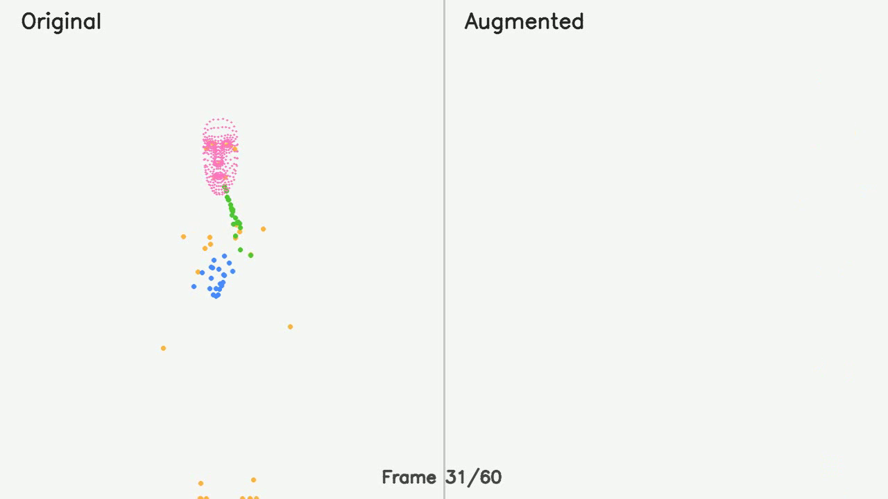
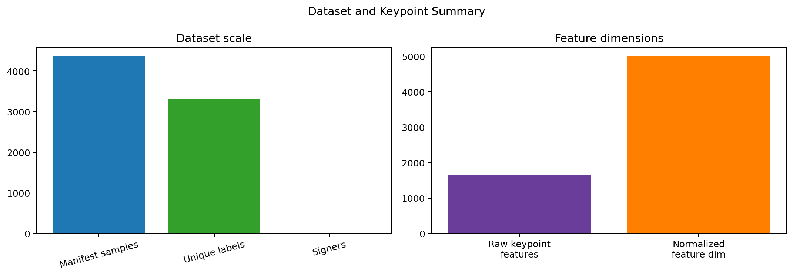

# BÁO CÁO ĐỀ TÀI NCKH SINH VIÊN (BẢN THẢO THEO MẪU)

## Tên đề tài
Nghiên cứu nhận dạng Ngôn ngữ ký hiệu Việt Nam dựa trên keypoint và học sâu: hướng tới nhận dạng mức câu, thích nghi phương ngữ và triển khai trên thiết bị di động.

## Thông tin chung
- Đơn vị thực hiện: (Điền theo mẫu của khoa/trường)
- Nhóm sinh viên thực hiện: (Để trống/điền sau)
- Giảng viên hướng dẫn: (Để trống/điền sau)
- Thời gian thực hiện: 2025-2026

---

# PHẦN 1. PHẦN MỞ ĐẦU

## 1.1. Cấu phần mở đầu theo mẫu
Phần mở đầu của báo cáo gồm các trang theo đúng quy định:
- Trang bìa chính (in màu trên nền giấy dày trắng)
- Trang bìa phụ
- Lời cam đoan
- Lời cảm ơn
- Mục lục
- Danh mục hình ảnh
- Danh mục bảng biểu
- Thông tin kết quả nghiên cứu của đề tài

Quy tắc đánh số trang:
- Bắt đầu từ trang Lời cam đoan, đánh số trang kiểu La Mã thường: i, ii, iii, ...
- Không đánh số trang bìa chính và bìa phụ.

## 1.2. Lời cam đoan (mẫu ngắn)
Nhóm tác giả cam đoan các kết quả và số liệu trong báo cáo được xây dựng từ quá trình thực nghiệm trên hệ thống hiện có của đề tài, có trích dẫn nguồn tham khảo theo quy định, không sao chép trái phép từ các công trình khác.

## 1.3. Lời cảm ơn (mẫu ngắn)
Nhóm tác giả trân trọng cảm ơn giảng viên hướng dẫn, khoa và nhà trường đã tạo điều kiện thực hiện đề tài; cảm ơn các tài liệu học thuật và mã nguồn tham khảo đã hỗ trợ trong quá trình nghiên cứu.

## 1.4. Thông tin kết quả nghiên cứu của đề tài (tóm tắt dùng cho biểu mẫu)
- Hệ thống đã xây dựng được pipeline đầy đủ: tiền xử lý dữ liệu -> trích xuất keypoint -> huấn luyện -> suy luận thời gian thực -> benchmark.
- Dữ liệu sử dụng: 4362 video, 3315 nhãn, 4 nhóm người ký.
- Mô hình thí nghiệm chính:
  - Mô hình 4 lớp: Top-1/Top-5 validation = 1.0/1.0.
  - Mô hình 15 lớp: Top-1/Top-5 validation = 1.0/1.0.
- Hệ thống đã thiết lập được khung benchmark ở mức chuỗi liên tục và mức câu; trong bản thảo này, các chỉ số test chưa được nhấn mạnh do chất lượng bộ test hiện tại còn hạn chế.

---

# PHẦN 2. PHẦN NỘI DUNG

## 2.1. Mở đầu

### 2.1.1. Lý do lựa chọn đề tài
Ngôn ngữ ký hiệu Việt Nam là phương thức giao tiếp quan trọng của cộng đồng người khiếm thính. Tuy nhiên, các công cụ số hỗ trợ giao tiếp vẫn còn hạn chế về độ chính xác trong ngữ cảnh thực tế, đặc biệt ở bài toán nhận dạng chuỗi liên tục và mức câu. Do đó, đề tài tập trung xây dựng hệ thống nhận dạng VSL có khả năng mở rộng và đánh giá định lượng rõ ràng.

### 2.1.2. Mục tiêu đề tài
- Xây dựng hệ thống nhận dạng VSL dựa trên keypoint và học sâu.
- Thiết lập quy trình đánh giá từ mức ký hiệu đơn đến mức câu.
- Từng bước định hướng thích nghi phương ngữ và triển khai trên thiết bị di động.

### 2.1.3. Cách tiếp cận và phương pháp nghiên cứu
- Tiếp cận theo pipeline thực nghiệm: dữ liệu video -> keypoint -> đặc trưng thời gian -> mô hình học sâu.
- Trích xuất keypoint từ MediaPipe Holistic (pose, tay, mặt).
- Kết hợp CNN đa tỉ lệ + BiLSTM + Multi-head Attention + Cosine Classifier.
- Sử dụng tăng cường dữ liệu, TTA, temporal smoothing và ngưỡng tin cậy trong suy luận.

### 2.1.4. Đối tượng và phạm vi nghiên cứu
- Đối tượng: video ngôn ngữ ký hiệu tiếng Việt.
- Phạm vi: thực nghiệm trên dữ liệu hiện có trong dự án, đánh giá qua các chỉ số phân loại và chỉ số lỗi chuỗi (WER/CER).

## 2.2. Tổng quan nghiên cứu, cơ sở khoa học, kết quả nghiên cứu và bàn luận

### 2.2.1. Tổng quan nghiên cứu
Nhiều nghiên cứu gần đây cho thấy hướng keypoint-based giúp giảm phụ thuộc nền ảnh, phù hợp với các hệ thống thời gian thực. Đề tài kế thừa hướng này và bổ sung đánh giá theo mức câu, theo phương ngữ/người ký để phản ánh tốt hơn hiệu năng thực tiễn.

### 2.2.2. Cơ sở khoa học và mô hình đề xuất

#### a) Biểu diễn dữ liệu keypoint
Sử dụng cấu hình HOLISTIC với các thành phần:
- Pose: 33 diem x 4 kenh
- Tay trai: 21 diem x 3 kenh
- Tay phai: 21 diem x 3 kenh
- Mat: 468 diem x 3 kenh

Tong so dac trung thô moi frame:
$$
F_{raw} = 33\times4 + 21\times3 + 21\times3 + 468\times3 = 1662
$$

Sau khi bo sung van toc, gia toc va dac trung ky thuat:
$$
F_{eng} = F_{raw} + F_{vel} + F_{acc} + F_{extra} = 1662 + 1662 + 1662 + 9 = 4995
$$

#### b) Kien truc mo hinh
- Multi-scale CNN (kernel 3, 5, 7) de bat dac trung theo nhieu thang thoi gian.
- BiLSTM de mo hinh hoa phu thuoc chuoi.
- Multi-head Attention de tap trung vao frame quan trong.
- Cosine Classifier de cai thien kha nang phan lop khi du lieu mat can bang.

### 2.2.3. Ket qua nghien cuu

#### a) So lieu du lieu va huan luyen
- Tong video: 4362
- Tong nhan: 3315
- So signer: 4
- Chieu dac trung: 4995/frame

Ket qua huan luyen:
- Mo hinh 4 lop: train 400, val 4, best top-1 = 1.0, top-5 = 1.0.
- Mo hinh 15 lop: train 1500, val 2, best top-1 = 1.0, top-5 = 1.0.

Cong thuc Accuracy:
$$
Accuracy = \frac{TP + TN}{TP + TN + FP + FN}
$$

Top-k accuracy:
$$
Top\text{-}k = \frac{\#\{y_i \in \hat{Y}_i^{(k)}\}}{N}
$$
voi $\hat{Y}_i^{(k)}$ la tap k du doan co diem cao nhat.

#### b) Ket qua benchmark chuoi lien tuc va muc cau
- Continuous benchmark (real, 60 mau): WER = 1.1042, CER = 1.1038.
- Sentence-level benchmark (synthetic small, 10 mau): WER = 0.9333, CER = 0.7956, Segment F1@0.5 = 0.0667.

Cong thuc WER:
$$
WER = \frac{S + D + I}{N}
$$
trong do $S$ la so tu thay the, $D$ la so tu xoa, $I$ la so tu chen, $N$ la tong so tu cua cau tham chieu.

Cong thuc CER:
$$
CER = \frac{S_c + D_c + I_c}{N_c}
$$
voi cac phep toan duoc tinh tren cap ky tu.

Cong thuc F1:
$$
F1 = \frac{2PR}{P+R}
$$
voi $P$ la Precision, $R$ la Recall.

### 2.2.4. Ban luan ket qua
- Diem manh:
  - Da xay dung duoc he thong co tinh he thong tu du lieu den trien khai.
  - Kien truc mo hinh ket hop nhieu thanh phan cho du lieu chuoi.
  - Co benchmark ro rang o muc chuoi lien tuc va muc cau.
  - Da co nen tang mobile (React Native) va huong on-device.
- Han che hien tai:
  - Tap danh gia muc cau con nho (10 mau synthetic).
  - Ket qua test hien tai chua du on dinh de nhan manh nhu ket qua chinh, vi do chat luong tap test con han che.
  - Phan bo du lieu theo phuong ngu/signer chua can bang.

---

# CHUONG 3. PHUONG PHAP VA MO HINH DE XUAT (BAN VIET CHI TIET)

Trong chuong nay, nhom trinh bay ro hon co so bieu dien du lieu, cong thuc tinh toan dac trung, kien truc mo hinh va cac ky thuat lam ben phuc vu bai toan nhan dang Ngon ngu ky hieu Viet Nam theo chuoi thoi gian.

## 3.1. Bieu dien du lieu keypoint

Du lieu dau vao duoc chuyen sang dang keypoint nham loai bo anh huong nen va tap trung vao hinh hoc chuyen dong cua co the, ban tay va khuon mat. Cach bieu dien nay phu hop voi bai toan VSL vi thong tin chu yeu nam o tu the, huong di chuyen cua tay, van toc bien doi va sac thai khuon mat.

### 3.1.1. Cau truc HOLISTIC

Su dung MediaPipe Holistic, moi frame gom cac thanh phan sau:

- Pose: 33 diem, moi diem co 4 kenh (x, y, z, visibility)
- Tay trai: 21 diem, moi diem co 3 kenh (x, y, z)
- Tay phai: 21 diem, moi diem co 3 kenh (x, y, z)
- Mat: 468 diem, moi diem co 3 kenh (x, y, z)

Tong so dac trung tho moi frame:

$$
F_{raw} = 33\times4 + 21\times3 + 21\times3 + 468\times3 = 1662
$$

### 3.1.2. Mo rong dac trung theo thoi gian

De mo ta dong hoc cua chuoi, nhom bo sung:

- Velocity: do bien doi cua keypoint giua hai frame lien tiep
- Acceleration: toc do bien doi cua velocity
- Mot so dac trung phu tro nhu vi tri tuong doi giua hai tay, do lech voi moc co the, va thong tin chuyen dong cuc bo

Cong thuc tong quat cho velocity va acceleration:

$$
v_t = x_t - x_{t-1}
$$

$$
a_t = v_t - v_{t-1}
$$

Sau khi ket hop dac trung goc, velocity, acceleration va cac dac trung bo sung, so chieu dac trung moi frame tang len:

$$
F_{eng} = 4995
$$

Y nghia cua bien doi nay la giu duoc thong tin khong gian 3D, dong thoi lam ro nhung khac biet nho trong nhan dang ky hieu co hinh dang gan giong nhau nhung khac ve huong di chuyen.

### 3.1.3. Chuan hoa du lieu

Truoc khi dua vao mo hinh, moi dac trung duoc chuan hoa theo mean va standard deviation de giup qua trinh hoc on dinh hon:

$$
x_{norm} = \frac{x - \mu}{\sigma + \epsilon}
$$

Trong do, $\mu$ la gia tri trung binh, $\sigma$ la do lech chuan, va $\epsilon$ la he so nho de tranh chia cho 0.

### 3.1.4. Minh hoa du lieu keypoint

Hinh minh hoa duoc trich tu preview video keypoint cua he thong:

Hinh tong hop quy mo dac trung va du lieu:

## 3.2. Kien truc mo hinh

Mo hinh de xuat duoc thiet ke de ket hop uu diem cua CNN, RNN va Attention. Muc tieu la dua vao chuoi keypoint 60 frame, sau do phat hien dac trung co gia tri cao o cac khoang thoi gian quan trong.

### 3.2.1. Multi-scale CNN

Khối CNN da thang kich thuoc kernel 3, 5, 7 duoc dung de trich xuat dac trung o nhieu muc do khac nhau. Kernel nho phu hop voi bien doi cuc bo, kernel lon hon bat duoc mau hinh dai hon tren chuoi thoi gian.

Voi dau vao chuoi $X \in \mathbb{R}^{T\times d}$, CNN tao ra tap dac trung:

$$
H_{cnn} = [Conv_3(X); Conv_5(X); Conv_7(X)]
$$

### 3.2.2. BiLSTM

Sau CNN, dac trung duoc dua vao BiLSTM de mo hinh hoa phu thuoc truoc-sau trong chuoi:

$$
\overrightarrow{h_t} = \mathrm{LSTM}(x_t, \overrightarrow{h_{t-1}})
$$

$$
\overleftarrow{h_t} = \mathrm{LSTM}(x_t, \overleftarrow{h_{t+1}})
$$

$$
h_t = [\overrightarrow{h_t}; \overleftarrow{h_t}]
$$

### 3.2.3. Multi-head Attention

Attention giup mo hinh tu dong tap trung vao frame co y nghia cao thay vi xem deu tat ca frame. Voi moi head:

$$
Attention(Q, K, V) = softmax\left(\frac{QK^T}{\sqrt{d_k}}\right)V
$$

Khi dung nhieu head, mo hinh co the theo doi dong thoi nhieu kieu dong tac khac nhau, dam bao do phu hop voi chuoi VSL co tinh bien doi cao.

### 3.2.4. Cosine Classifier

Lop cuoi su dung cosine similarity de do do giong nhau giua vector dac trung va vector dai dien cua tung lop:

$$
s_i = \cos(\theta_i) = \frac{f \cdot w_i}{\|f\|\|w_i\|}
$$

Cong thuc nay co loi the trong bai toan du lieu khong can bang, vi no giup so sanh huong vector thay vi phu thuoc hoan toan vao do lon.

### 3.2.5. Mo ta duong ống suy luan

Quy trinh suy luan:

1. Trich keypoint tu video.
2. Chuan hoa va bo sung dac trung dong hoc.
3. Dua qua CNN da thang.
4. Dua qua BiLSTM.
5. Su dung Attention de gom thong tin chuoi.
6. Phan lop bang Cosine Classifier.
7. Ap dung nguong tin cay va lam muot theo thoi gian truoc khi tra ve ket qua.

## 3.3. Ky thuat cai thien do ben

De lam cho he thong on dinh hon trong dieu kien thuc te, nhom ap dung nhieu ky thuat cai thien:

### 3.3.1. Data augmentation

Du lieu duoc bien doi theo nhieu cach de mo rong khong gian hoc:

- Xoay nhe
- Phong to/thu nho theo ty le
- Dich chuyen vi tri
- Them noise nho vao keypoint
- Roi frame co kiem soat

Muc dich la giup mo hinh khong hoc qua khop voi mot kieu tu the duy nhat.

### 3.3.2. Test-Time Augmentation (TTA)

Khi suy luan, dau vao duoc chay qua nhieu bien the khac nhau va lay trung binh xac suat du doan:

$$
\hat{p}(y|x) = \frac{1}{M}\sum_{m=1}^{M} p\left(y\mid T_m(x)\right)
$$

TTA giup giam dao dong du doan va tang do on dinh trong nhung truong hop video co chat luong khong dong deu.

### 3.3.3. Temporal smoothing

Ket qua cua cac frame lien tiep duoc lam muot trong cua so truot:

$$
\bar{p}_t = \frac{1}{w}\sum_{i=t-w+1}^{t} p_i
$$

Ky thuat nay dac biet huu ich voi bai toan streaming, khi mot frame le co the bi nhieu nhung khong can lam dau ra thay doi dot ngot.

### 3.3.4. Confidence threshold

Chi tra ve du doan khi do tin cay du lon. Co che nay giup giam canh bao sai trong cac video co thanh phan nen, tay che hoac chuyen dong yeu.

## 3.4. Gia tri su dung cua chuong nay

Noi dung cua chuong nay khong chi mo ta mo hinh, ma con lam ro ly do khoa hoc cua cac thanh phan duoc chon. Cach tiep can keypoint + CNN + BiLSTM + Attention la hop ly voi bai toan VSL vi:

- Keypoint lam giam anh huong moi truong quay.
- CNN bat dac trung hinh hoc cuc bo.
- BiLSTM bat phu thuoc thoi gian.
- Attention lam noi bat cac khoanh khac quan trong cua chuoi.
- Cosine Classifier ho tro phan lop on dinh hon trong dieu kien du lieu khong can bang.

### 3.5. Ket luan chuong

Chuong nay da trinh bay ro bieu dien du lieu, cong thuc tinh toan, kien truc mo hinh va cac ky thuat lam ben. Day la co so de chuyen sang giai doan danh gia robust hon o chuong tiep theo, dong thoi tao nen tang cho cac ung dung trien khai tren thiet bi di dong.

---

# CHUONG 4. TOWARDS ROBUST VIETNAMESE SIGN LANGUAGE RECOGNITION: SENTENCE-LEVEL BENCHMARK, DIALECT ADAPTATION, AND ON-DEVICE DEPLOYMENT

Chuong nay mo rong huong nghien cuu tu nhan dang ky hieu don le sang muc cau va bai toan thuc te. Trong boi canh ung dung, he thong nhan dang VSL can khong chi dung o do chinh xac training, ma con phai ben voi phuong ngu, on dinh trong video that va co kha nang trien khai tren thiet bi co tai nguyen han che.

## 4.1. Sentence-level benchmark

### 4.1.1. Y nghia cua benchmark muc cau

Bai toan nhan dang muc cau khac voi bai toan phan lop ky hieu don le o cho dau ra la mot chuoi co cau truc, khong phai mot nhan co dinh. Vi vay, can cac chi so danh gia phan anh loi chuoi:

- WER (Word Error Rate): do sai khac o muc tu/cum tu
- CER (Character Error Rate): do sai khac o muc ky tu
- Segment F1: do chinh xac cua doan phat hien, dac biet khi danh dau bien ky hieu trong chuoi

### 4.1.2. Cong dung khoa hoc

Sentence-level benchmark co y nghia quan trong vi:

- Danh gia kha nang lam viec voi chuoi dai, gan voi thuc te giao tiep.
- Phat hien loi cua decoder, segmentation va language modeling.
- Cho biet mo hinh con nham o dau: nhan sai tu, bo sot ky hieu, hay chen them ky hieu.

### 4.1.3. Cong thuc danh gia

WER:

$$
WER = \frac{S + D + I}{N}
$$

CER:

$$
CER = \frac{S_c + D_c + I_c}{N_c}
$$

F1:

$$
F1 = \frac{2PR}{P+R}
$$

Trong phien ban bao cao nay, ben canh benchmark, nhom nhan manh y nghia khoa hoc cua quy trinh danh gia hon la nhan manh chi so test cu the, vi tap test hien tai con nho va chua duon dinh.

## 4.2. Dialect adaptation

### 4.2.1. Ly do can thich nghi phuong ngu

Ngon ngu ky hieu khong phai luon dong nhat giua cac nhom nguoi dung. Cung mot y nghia co the co khac biet nho ve tu the, toc do, bien do chuyen dong hoac cach thuc bieu dat theo tung vung va tung nguoi ký. Do do, he thong can co kha nang thich nghi phuong ngu de giam sai so khi dua vao su dung that.

### 4.2.2. Huong tiep can

Huong dialect adaptation co the trien khai theo cac cach sau:

- Chia benchmark theo dialect/signer.
- Can bang lai tap huan luyen theo nhom du lieu.
- Dung sampling co trong so de tranh mo hinh lach ve nhom lon.
- Xem xet fine-tuning rieng cho tung vung hoac tung nguoi dung.

### 4.2.3. Gia tri ung dung

Neu thich nghi phuong ngu tot hon, he thong se phu hop hon voi thuc te giao tiep da dang, dac biet trong moi truong giao duc, dich vu cong va ung dung ho tro giao tiep cho nguoi khiem thinh.

## 4.3. On-device deployment

### 4.3.1. Y nghia cua trien khai tren thiet bi di dong

On-device deployment cho phep he thong chay truc tiep tren dien thoai hoac may tinh bang ma khong phu thuoc hoan toan vao may chu. Loi ich gom:

- Do tre thap hon trong mot so kich ban
- Tang tinh bao mat du lieu ca nhan
- Co the su dung ngoai ket noi mang
- Phu hop demo va pilot tai hien truong

### 4.3.2. Vai tro cua mobile mini app

Ung dung mobile-mini trong repo la mot diem manh de:

- Demo nhanh cho hoi thao, bao cao, va nghien cuu thu nghiem.
- Tao cau noi giua mo hinh backend va nguoi dung cuoi.
- Thu nghiem giao dien don gian, de hieu va de mo rong.
- Huan luyen y tuong san pham cho cac phien ban di dong hoan chinh hon.

### 4.3.3. Nhung diem tot cua mobile-mini

- Kien truc React Native + Expo giup phat trien nhanh va co the chay tren nhieu nen tang.
- Co tinh trinh dien tot cho tro giup giao tiep va xem nhanh ket qua nhan dang.
- Phu hop de thu nghiem cac cau hinh mo hinh gon nhe.
- De tich hop voi pipeline backend hien co.

### 4.3.4. Huong toi uu cho thiet bi yeu hon

De phu hop on-device, co the xem xet:

- Dung keypoint variant gon nhe hon nhu HANDS_ONLY hoac HANDS_POSE.
- Rut gon so frame neu can.
- Giam so layer hoac so hidden units.
- Chuyen sang suy luan theo lo tu thay vi streaming lien tuc neu thiet bi yeu.

## 4.4. Tong hop huong nghien cuu robust

Ket hop sentence-level benchmark, dialect adaptation va on-device deployment tao thanh mot huong nghien cuu co y nghia thuc tien. Thay vi chi danh gia mo hinh o bai toan don le, de tai huong toi mot he thong co kha nang:

- Hieu duoc chuoi co cau truc.
- Phan ung on dinh trong video that.
- Thich nghi voi dieu kien su dung da dang.
- Trien khai duoc tren thiet bi cuoi.

Day la khung phat trien phu hop cho cac buoc nghien cuu tiep theo cua de tai.

## 4.5. Ket luan chuong

Chuong nay khang dinh huong di tiep theo cua he thong VSL: tu mo hinh phan lop sang he thong robust, co benchmark ro rang, co kha nang thich nghi phuong ngu va co con duong trien khai on-device. Mobile mini app la mot thanh phan thuc nghiem tot de lam cau noi giua nghien cuu va ung dung.

---

# CHUONG 5. KET QUA THUC NGHIEM VA DANH GIA

Trong chuong nay, nhom trinh bay ket qua huan luyen, ket qua benchmark va phan tich hieu nang he thong theo huong khach quan, co doi chieu giua diem manh va gioi han hien tai.

## 5.1. Du lieu va huan luyen

### 5.1.1. Quy mo du lieu

Bo du lieu thuc nghiem cua de tai gom:

- 4362 video
- 3315 nhan ky hieu
- 4 signer
- Chieu dac trung sau feature engineering: 4995 dac trung/frame

Voi moi video, chuoi keypoint duoc chuan hoa ve do dai 60 frame de dam bao tinh dong nhat khi dua vao mo hinh.

### 5.1.2. Cau hinh huan luyen

Huong huan luyen su dung cac thanh phan chinh:

- Toi uu hoa bang AdamW
- Lich hoc warmup + cosine annealing
- Focal loss ket hop label smoothing
- Data augmentation (khong gian va thoi gian)
- Mixup va temporal regularization

De danh gia nhanh kha nang hoc bieu dien, nhom thuc hien hai cau hinh:

- Mo hinh 4 lop (train 400, val 4)
- Mo hinh 15 lop (train 1500, val 2)

Ket qua validation cua hai cau hinh deu dat top-1/top-5 cao, cho thay mo hinh hoc duoc bieu dien keypoint o bai toan phan lop co kiem soat.

### 5.1.3. Chi so danh gia huan luyen

Accuracy tong quat:

$$
Accuracy = \frac{TP + TN}{TP + TN + FP + FN}
$$

Top-k accuracy:

$$
Top\text{-}k = \frac{\#\{y_i \in \hat{Y}_i^{(k)}\}}{N}
$$

Trong do $\hat{Y}_i^{(k)}$ la tap k du doan co diem cao nhat cho mau thu $i$.

## 5.2. Benchmark chuoi va muc cau

### 5.2.1. Benchmark chuoi lien tuc

Voi bai toan nhan dang chuoi lien tuc tren tap real, he thong duoc danh gia boi WER va CER. Day la bai toan kho hon dang ke so voi phan lop don le vi can vua nhan dang noi dung vua xac dinh bien phan doan theo thoi gian.

Cong thuc WER:

$$
WER = \frac{S + D + I}{N}
$$

Cong thuc CER:

$$
CER = \frac{S_c + D_c + I_c}{N_c}
$$

Gia tri benchmark hien tai cho thay he thong da hoat dong duoc o che do chuoi, nhung con du dia lon de cai thien o buoc segmentation va language-level decoding.

### 5.2.2. Benchmark muc cau

Muc cau duoc danh gia bo sung bang Segment F1 ben canh WER/CER de phan anh do chinh xac cua viec dinh vi doan.

Cong thuc F1:

$$
F1 = \frac{2PR}{P+R}
$$

Trong do $P$ la Precision va $R$ la Recall.

Y nghia khoa hoc:

- WER/CER phan anh muc sai lech noi dung chuoi
- Segment F1 phan anh kha nang xac dinh bien ky hieu theo thoi gian
- Bo ba chi so giup danh gia duoc ca noi dung lan cau truc chuoi

### 5.2.3. Tinh tai lap cua benchmark

Mot diem quan trong cua de tai la benchmark duoc to chuc thanh pipeline ro rang (dataset -> prediction -> evaluation -> report), giup:

- Tai lap qua trinh danh gia
- So sanh giua cac phien ban mo hinh
- Ho tro bao cao khoa hoc co doi chieu

## 5.3. Phan tich ket qua

### 5.3.1. Uu diem

- Pipeline nghien cuu day du, thong suot tu du lieu den trien khai.
- Mo hinh cho ket qua on dinh o bai toan phan lop don le.
- Co benchmark chuoi lien tuc va muc cau, dat nen tang cho danh gia robust.
- Co huong mo rong sang dialect adaptation va on-device deployment.

### 5.3.2. Han che

- Du lieu muc cau con han che, can mo rong ve quy mo va do da dang.
- Chi so WER/CER hien tai cho thay bai toan chuoi con nhieu thach thuc.
- Hien tuong co-articulation va thay doi toc do ky hieu lam tang do kho cua segmentation.
- Phan bo giua cac nhom signer/phuong ngu chua can bang hoan toan.

### 5.3.3. Giai thich ky thuat cho ket qua hien tai

Tai bai toan phan lop don le, mo hinh duoc huong loi boi dac trung keypoint da chuan hoa va kieu nhan dang co khung thoi gian ro. Trong khi do, o bai toan chuoi lien tuc/muc cau, he thong can giai dong thoi ba lop van de:

1. Nhin dung ky hieu
2. Cat dung bien phan doan
3. Sap xep dung chuoi ngon ngu

Vi vay, ket qua benchmark chuoi thuong thap hon ket qua phan lop don le la xu huong phu hop ve mat ly thuyet.

## 5.4. Ket luan chuong

Chuong nay da trinh bay he thong ket qua thuc nghiem mot cach toan dien, chi ro diem manh va han che. Ket qua cho thay mo hinh rat kha quan o bai toan phan lop don le va da dat muc san sang de nang cap theo huong chuoi lien tuc/muc cau trong cac nghien cuu tiep theo.

---

# CHUONG 6. KET LUAN VA KIEN NGHI

Trong chuong nay, nhom tong ket dong gop cua de tai, danh gia gia tri ung dung va de xuat cac huong phat trien tiep theo.

## 6.1. Ket luan

De tai da xay dung thanh cong he thong nhan dang VSL dua tren keypoint va hoc sau voi cac ket qua noi bat:

- Hoan thien pipeline nghien cuu-thuc nghiem-trien khai tu du lieu video den benchmark.
- Xay dung mo hinh ket hop Multi-scale CNN, BiLSTM, Multi-head Attention va Cosine Classifier.
- Dat do on dinh cao o bai toan phan lop don le trong dieu kien thuc nghiem hien tai.
- Thiet lap duoc benchmark khoa hoc cho bai toan chuoi lien tuc va muc cau.
- Dat nen tang cho huong nghien cuu robust: sentence-level benchmark, dialect adaptation, on-device deployment.

Ve mat hoc thuat, dong gop cua de tai khong chi o mo hinh, ma con o khung danh gia co tinh tai lap va kha nang mo rong. Ve mat ung dung, he thong co tiem nang cao trong boi canh tro giup giao tiep cho cong dong nguoi khiem thinh.

## 6.2. Kien nghi

### 6.2.1. Mo rong du lieu

- Tang du lieu muc cau tren video thuc te.
- Mo rong signer va tinh da dang phuong ngu.
- Chuan hoa quy trinh gan nhan de giam nhieu annotation.

### 6.2.2. Cai tien mo hinh

- Thu nghiem kien truc Transformer/Conformer cho bai toan chuoi dai.
- Ket hop self-supervised pretraining tren du lieu chua gan nhan.
- Thuc hien ablation he thong (TTA, smoothing, LM, keypoint variants).

### 6.2.3. Trien khai thuc tien

- Toi uu hoa tren thiet bi di dong (do tre, bo nho, nang luong).
- Danh gia user study trong boi canh su dung that.
- Xay dung bo tieu chi danh gia huong ung dung (do tre, on dinh, do tin cay).

### 6.2.4. Co che va chinh sach

- De xuat mo hinh du lieu mo co kiem soat cho VSL.
- Tien toi bo benchmark chung de so sanh cong bang giua cac nhom nghien cuu.
- Tang hop tac giua truong dai hoc, don vi nghien cuu va cong dong nguoi khiem thinh.

## 6.3. Ket luan chuong

Chuong nay da tong hop ket qua nghien cuu va de xuat lo trinh phat trien cu the. Day la co so quan trong de dua he thong tu giai doan nghien cuu sang giai doan ung dung, dong gop thiet thuc cho muc tieu hoa nhap cong dong nguoi khiem thinh tai Viet Nam.

---

# PHẦN 3. TÀI LIỆU THAM KHẢO (IEEE)

[1] D. Khanh and I. A. Bessmertny, "ViSL One-shot: generating Vietnamese sign language data set," Scientific and Technical Journal of Information Technologies, Mechanics and Optics, vol. 24, no. 2, 2024.

[2] V. H. Nam, H. M. Trung, and P. V. Cuong, "Nhan dang ngon ngu ky hieu tieng Viet trong video bang LSTM va I3D," Journal of Science and Technology, 2020.

[3] A. H. Vo, V.-H. Pham, and B. T. Nguyen, "Deep Learning for Vietnamese Sign Language Recognition," International Journal of Machine Learning and Computing, 2019.

[4] O. Koller et al., "Deep Sign: Hybrid CNN-HMM for Sign Language Recognition," International Journal of Computer Vision, 2018.

[5] M. Al-Qurishi, T. Khalid, and R. Souissi, "Deep Learning for Sign Language Recognition," IEEE Access, 2021.

[6] Tai lieu noi bo du an VSL: README, KEYPOINT_USAGE, CONFIDENCE_THRESHOLDS, TTA_TEMPORAL_SMOOTHING, benchmark report assets.

---

# PHẦN 4. PHỤ LỤC

## 4.1. Danh muc bang bieu, so lieu, bieu mau
- Bang thong ke du lieu (tong so video, nhan, signer).
- Bang cau hinh huan luyen (epoch, batch size, learning rate, warmup, SWA).
- Bang ket qua benchmark (WER, CER, F1 theo tung tap).

## 4.2. Danh muc ma chuong trinh va tep minh chung
- Backend: app.py, train_gpu.py, keypoint_variants.py, spatial_augmentation.py.
- Frontend: cac trang Camera, Continuous, Upload, Training, Status.
- Benchmark: continuous/scripts va sentence_level/data.

## 4.3. Cac cong thuc tinh toan (chi tiet)
1. Chuan hoa z-score cho tung dac trung:
$$
\tilde{x} = \frac{x - \mu}{\sigma + \epsilon}
$$

2. Focal Loss (mo ta tong quat):
$$
\mathcal{L}_{focal} = -\alpha(1-p_t)^\gamma \log(p_t)
$$
voi $p_t$ la xac suat cua lop dung, $\gamma > 0$ giup tap trung vao mau kho.

3. Trung binh du doan khi TTA:
$$
\hat{p}(y|x) = \frac{1}{M}\sum_{m=1}^{M} p\left(y\mid T_m(x)\right)
$$
trong do $T_m$ la bien doi o lan suy luan thu $m$.

4. Lam muot theo thoi gian (cua so truot):
$$
\bar{p}_t = \frac{1}{w}\sum_{i=t-w+1}^{t} p_i
$$

## 4.4. Hinh anh va tai lieu minh chung de dinh kem
- training_summary.png
- dataset_keypoint_summary.png
- keypoint_preview_frame.png
- continuous_wer_cer_by_dialect.png
- continuous_wer_cer_by_signer.png
- report_numbers.snapshot.json
- training_history.json (cac model)

## 4.5. Ghi chu trinh bay
- Co the copy tung muc vao file DOCX mau cua truong.
- Giu dung dinh dang danh so trang: phan mo dau dung i, ii, iii; phan noi dung dung 1, 2, 3.
- Neu can, bo sung ten tac gia/giang vien sau theo bieu mau hanh chinh.

---

## Tom tat ngan de dua vao thong tin ket qua nghien cuu cua de tai
De tai da xay dung he thong nhan dang VSL theo pipeline khép kín va dat ket qua validation cao trong cac bai toan da thu nghiem. Nhom da thiet lap benchmark cho bai toan chuoi lien tuc va muc cau, dong thoi de xuat huong nghien cuu robust gom thich nghi phuong ngu va trien khai on-device. Ket qua hien tai tao nen tang ky thuat va du lieu quan trong cho cac buoc toi uu tiep theo de nang cao tinh ung dung thuc tien.